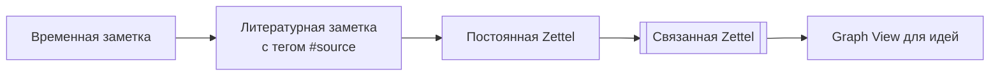

### 📚 Пошаговое руководство по методу Zettelkasten Лумана с адаптацией под Logseq  

#### 🔍 **1. Базовые принципы метода**  
- **Одна идея — одна заметка (Zettel)**  
  Каждая карточка содержит уникальную мысль, пример или цитату, сформулированную **своими словами** (это критично для усвоения) .  
- **Связи вместо папок**  
  Заметки связываются через перекрестные ссылки, создавая "сеть знаний" (как нейроны в мозге). Луман создал **~25,000 связей** в своей картотеке из 90,000 карточек .  
- **Контекстная нумерация**  
  Пример нумерации Лумана:  
  - Базовая заметка: `1/1` (тема 1, подтема 1).  
  - Развитие мысли: `1/1a`, затем `1/1a1` (для ответвлений).  
  - Новая тема: `1/2` .  

---

#### 🛠️ **2. Как создавать заметки: 4 шага**  
**Шаг 1: Временные записи (Fleeting Notes)**  
  - Фиксируйте мысли в любом формате (голос, бумага, приложение).  
  - **Пример:** Услышали в подкасте: "Креативность — это комбинирование старых идей". Запишите как есть .  

**Шаг 2: Литературные заметки (Literature Notes)**  
  - Конспектируйте прочитанное **своими словами** с указанием источника.  
  - **Пример для книги:**  
    > **Источник:** Аренс, "Как делать полезные заметки" (2022), стр. 45.  
    > **Идея:** Письмо ≠ создание текста. Это инструмент мышления, где заметки становятся "внешним мозгом".  
    .  

**Шаг 3: Постоянные заметки (Permanent Notes)**  
  - Превращайте временные записи в самодостаточные Zettel, связывая их с существующими. Алгоритм:  
    1. Спросите: *"Как это связано с моими знаниями/проектами?"*  
    2. Найдите 1–2 релевантные заметки в архиве.  
    3. Создайте новую карточку с ссылками.  
  - **Пример:**  
    > **Заголовок:** Связь креативности и Zettelkasten.  
    > **Текст:** "Метод Лумана автоматизирует комбинирование идей через связи (см. [[1/1a]]). Как сказал Аренс: 'Zettelkasten — машина для генерации инсайтов' . **Ссылка:** [[Титаник vs ДНК]]".  
    .  

**Шаг 4: Создание связей**  
  - Внизу каждой заметки добавляйте раздел `## Ссылки` с номерами связанных карточек.  
  - **Пример у Лумана:**  
    На карточке `21/3d5g` ссылки: `См. также: 18/4c1, 2/5a3` .  

---

#### 🌐 **3. Пример генерации идей (из практики Лумана)**  
- **Факт 1** (из книги о Титанике): *"Офицер увез ключи от шкафа с биноклями, что привело к крушению"* → Zettel: `Случайность. Бинокль` .  
- **Факт 2** (из статьи о науке): *"Ученые открыли ДНК, случайно изучая рак"* → Zettel: `Случайность. ДНК` .  
- **Связь:** Объедините в новую заметку:  
  > **Заголовок:** Роль случайности в катастрофах и открытиях.  
  > **Текст:** "Случайность может привести как к трагедии (Титаник), так и к прорыву (ДНК). Разница — в способности системы усиливать ошибки (см. [[Теория систем]])".  
  > **Ссылки:** `[[Случайность. Бинокль]], [[Случайность. ДНК]]`.  

---

#### 💻 **4. Адаптация под Logseq: практические инструкции**  
**(См. визуальную схему ниже)**  


**Шаг A: Настройка базы**  
- **Типы заметок:** Создайте шаблоны через `/template`:  
  ```markdown
  - Для **литературных заметок**:  
    tags:: #source  
    Источник:: [[{{название}}]], автор: {{имя}}, год: {{год}}  
    Цитата:: ...  
    Моя интерпретация:: ...  
  - Для **постоянных Zettel**:  
    tags:: #permanent  
    Ссылки:: [[...]]  
  ```  

**Шаг B: Эмуляция нумерации Лумана**  
  - Используйте `block references` вместо номеров. Например:  
    - Исходная заметка: `((6453f0f1-1a65-48b6-bc07-2259e8d57b75))` (ID блока о креативности).  
    - Новая связанная заметка: `Развитие: {{embed ((6453f0f1-1a65-48b6-bc07-2259e8d57b75)) }}`.  

**Шаг C: Создание связей**  
  - В разделе `## Ссылки` указывайте:  
    ```markdown
    - Связанные идеи: [[Креативность]], [[Случайность]]  
    - Источники: [[Аренс, 2022]]  
    ```  
  - Для визуализации: Откройте `Graph View` → фильтруйте по тегам (напр., `#креативность`).  

**Шаг D: Индекс ключевых слов**  
  - Создайте страницу `Индекс` с тегами:  
    ```markdown
    - #теория_систем: [[Роль случайности]], [[Zettelkasten как сеть]]  
    - #письмо: [[Письмо = мышление]]  
    ```  

---

#### ⚠️ **5. Ошибки новичков (и как их избежать)**  
- **Копирование вместо перефразирования**  
  → Всегда пишите идеи **своими словами** (иначе связей не возникнет) .  
- **Отсутствие связей**  
  → Каждая новая заметка должна ссылаться минимум на 1 существующую. Правило Лумана: "Если нет ссылок — заметка мертва" .  
- **Перегруженность тегами**  
  → Используйте 3–5 ключевых тегов на заметку. Пример: `#креативность #методология #случайность` .  

---

#### 💎 **Заключение: Как интегрировать это в daily life**  
- **Для учебы:** Конспектируйте лекции как литературные заметки → превращайте в постоянные Zettel, связывая с курсом (тег `#курс_по_социологии`).  
- **Для проектов:** Создавайте заметки-задачи (`#проект_X`), привязывая к ним идеи из Zettelkasten.  
- **Для письма:** Формируйте "последовательности заметок" (как у Лумана) → экспортируйте в черновик через Logseq PDF-генератор.  

> **Важно:** Начните с 3 заметок в день. Луман за 30 лет создал 90,000 карточек — но ключ в систематичности, а не в объеме .  

Для углубления:  
- Изучите оригинальную структуру картотеки Лумана: [Как на самом деле была устроена картотека Лумана](https://fedorovpishet.ru/real-zettelkasten/) .  
- Шаблоны для Logseq: [Гайд по Zettelkasten в Logseq](https://netpeak.net/ru/blog/vtoroy-mozg-gayd-po-sisteme-umnykh-zametok-zettelkasten-pervaya-chast/) .